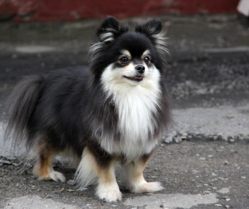

##  LARGE SPITS

Origin. The ancestors of this breed are the ancient canis familiaris palustris, so the Great Spitz can be considered the predecessor of all modern dog breeds. The remains of dogs that lived 10 thousand years ago were found during excavations in Asia, Africa and Northern Europe.

Description. These dogs must be at least 40 cm tall and weigh about 18 kg. The large Spitz has a medium-sized head, a wedge-shaped skull, a flattened nasal bridge with a black or brown lobe, depending on the color of the coat. The eyes are dark, slanted. The ears are small, pointed, triangular, erect. The tail is curled and carried over the back. The coat is thick and long everywhere except the muzzle, ears and paws, where it is shorter. Depending on the color of the large Spitz, they are divided into four varieties: wolf Spitz (silver-gray with black spots), black Spitz (skin, undercoat and guard hair are completely black), white Spitz (completely white, without a yellowish tint), brown Spitz (solid dark brown color). The Wolf Spitz may be slightly larger than other Large Spitz varieties.
 
Character. They are alive, loyal, smart, bark a lot, suspicious of strangers.

Application. These are decorative dogs that are so attached to their home that they are ready to protect it, like real watchmen. Physically and psychologically, these dogs mature at the age of three.

##  Dwarf Spitz

Description. The Miniature Spitz is a smaller copy of the Great Spitz. The height of these dogs should not exceed 28 cm, and the weight - 3.75 kg. The dwarf spitz is characterized by a wedge-shaped head, dark, slightly almond-shaped eyes, sharp erect ears, and a tail curled over its back. These dogs have a fluffy coat that makes them look like a toy. There are six varieties of this breed, which differ in color: black, white, brown, wolf and orange dwarf spitz.

Character. They are extremely loyal to the family in which they live, suspicious of strangers, smart, proud.
 
Application. These dogs have all the qualities to become a wonderful family pet. They love their home and will protect it from uninvited guests.

Note. These dogs are extremely resistant to disease, but nutritional care must be taken to avoid intestinal disturbances.

##  JAPANESE SPITZ

Origin. A direct descendant of the Norbotten Spitz, brought to Japan several centuries ago, where this breed was selected and subsequently gained great popularity.

Description. Height: from 30 to 40 cm - male, from 25 to 35 cm - female. Weight about 10 kg. These dogs have a rather wide head, a smooth transition from the forehead to a pointed muzzle, a small black nose. The teeth are strong and not protruding. The eyes are slanted, dark. The ears are small, erect, pointed. The tail is covered with long hair, wrapped and slung over the back. The coat is thick, pure white in color.

Character. Cheerful, brave, proud, very smart, devoted to their master, but, like all Spitz, suspicious of strangers.

Application. These are wonderful pets that, if necessary, will, barking and growling, protect their home from strangers. The coat must be carefully looked after: combing often and sometimes bathing the dog.

